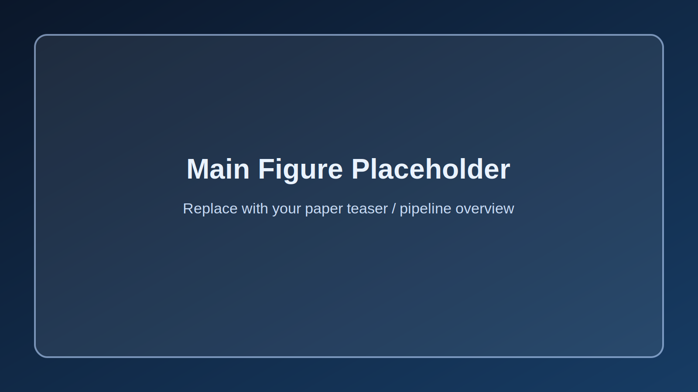

<div align="center">
  <h1>Snap, Segment, Deploy: A Visual Data and Detection Pipeline for Wearable Industrial Assistants</h1>

<div>
    <a href='https://scholar.google.com/citations?user=aqGMqEcAAAAJ&hl=en' target='_blank'>Di Wen</a>&emsp;
    <a href='https://scholar.google.com/citations?user=i6RJsvwAAAAJ&hl=en' target='_blank'>Junwei Zheng</a>&emsp;
    <a href='https://scholar.google.com/citations?user=tJYUHDgAAAAJ&hl=en' target='_blank'>Ruiping Liu</a>&emsp;
    Yi Xu;
    <a href='https://scholar.google.com/citations?user=pA9c0YsAAAAJ&hl=en' target='_blank'>Kunyu Peng&#8224;</a>&emsp;
    <a href='https://scholar.google.com/citations?user=SFCOJxMAAAAJ&hl=en' target='_blank'>Rainer Stiefelhagen</a>
</div>

<strong>Accepted to <a href='https://www.ieeesmc2025.org/' target='_blank'>IEEE SMC 2025</a></strong><br>
<sub>&#8224; Corresponding author</sub><br><br>

[](https://arxiv.org/abs/2507.21072)
[](https://www.python.org/)
[](LICENSE)
[](https://github.com/Kratos-Wen/Gear8)
[](https://github.com/Kratos-Wen/Gear8/forks)
</div>

<p align="center">
  
</p>

<p align="center">
  Replace <code>assets/main_figure.svg</code> with your paper main figure (for example, <code>assets/main_figure.png</code>).
</p>

## Overview
This repository provides a clean, modularized implementation of the Snap-Segment-Deploy pipeline with paper-aligned module naming:

- `Snap`: multi-view data capture for part images.
- `Segment`: synthetic composition and optional Background-Agnostic Refinement (BAR) utilities.
- `Deploy`: retrieval-augmented multimodal interaction with detection, depth, ASR, and local LLM reasoning.

The runtime logic remains aligned with the original `User_Study_AVCR.py` behavior while exposing modular boundaries for extension and ablation studies.

## Repository Layout
```text
snap_segment_deploy/
├── run_deploy_stage.py
├── snap_segment_deploy_assistant/
│   ├── config.py
│   ├── deploy_stage_runtime.py
│   ├── query_acquisition.py
│   ├── semantic_retrieval_and_response_generation.py
│   ├── retrieval_augmented_multimodal_interaction.py
│   ├── speech_input_output.py
│   ├── knowledge_base_construction.py
│   ├── background_agnostic_refinement.py
│   ├── snap_stage_data_capture.py
│   ├── segment_stage_synthetic_composition.py
│   └── types.py
└── assets/
    └── main_figure.svg
```

## Setup
### 1. Environment
Use Python 3.10+ and install dependencies according to your platform/CUDA setup.

```bash
pip install -U pip
pip install torch torchvision ultralytics opencv-python numpy faiss-cpu sentence-transformers
pip install llama-cpp-python sounddevice pyttsx3 pygame openai-whisper
```

If your project uses a local `Depth Anything` source tree, make sure it is importable in your environment.

### 2. Path Configuration
Edit `snap_segment_deploy_assistant/config.py` and set the actual paths for:

- `PathConfig.yolo_weights`
- `PathConfig.llm_model`
- `PathConfig.components_json`

## Run
From the repository root:

```bash
python run_deploy_stage.py
```

Runtime controls:

- Press `v` to start voice query.
- Press `r` to restart detection.
- Press `q` to quit.

## Output
- Detection visualization is saved as `merged_output.jpg` by default.
- Query responses are generated with retrieved context and spoken via TTS.

## Notes for Release
- Replace placeholder badge links (`YOUR_ORG/YOUR_REPO`, `XXXX.XXXXX`) before public release.
- Replace `assets/main_figure.svg` with your final paper figure.
