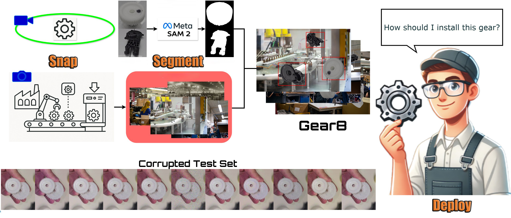

<div align="center">
  <h1>Snap, Segment, Deploy: A Visual Data and Detection Pipeline for Wearable Industrial Assistants</h1>

<div>
    <a href='https://scholar.google.com/citations?user=aqGMqEcAAAAJ&hl=en' target='_blank'>Di Wen</a>&emsp;
    <a href='https://scholar.google.com/citations?user=i6RJsvwAAAAJ&hl=en' target='_blank'>Junwei Zheng</a>&emsp;
    <a href='https://scholar.google.com/citations?user=tJYUHDgAAAAJ&hl=en' target='_blank'>Ruiping Liu</a>&emsp;
    <a href='mailto:xuyipc@yeah.net'>Yi Xu</a>&emsp;
    <a href='https://scholar.google.com/citations?user=pA9c0YsAAAAJ&hl=en' target='_blank'>Kunyu Peng&#8224;</a>&emsp;
    <a href='https://scholar.google.com/citations?user=SFCOJxMAAAAJ&hl=en' target='_blank'>Rainer Stiefelhagen</a>
</div>

<strong>Accepted to <a href='https://www.ieeesmc2025.org/' target='_blank'>IEEE SMC 2025</a></strong><br>
<sub>&#8224; Corresponding author</sub><br><br>

[](https://arxiv.org/abs/2507.21072)
[](https://www.python.org/)
[](LICENSE)
[](https://github.com/Kratos-Wen/Gear8)
[](https://github.com/Kratos-Wen/Gear8/forks)
</div>

<p align="center">
  
</p>

## Overview
This repository provides a clean, modularized implementation of the Snap-Segment-Deploy pipeline with paper-aligned module naming:

- `Snap`: multi-view data capture for part images.
- `Segment`: synthetic composition and optional Background-Agnostic Refinement (BAR) utilities.
- `Deploy`: retrieval-augmented multimodal interaction with detection, depth, ASR, and local LLM reasoning.

## Path Configuration Notice
- This repository does **not** depend on any personal local path.
- In this README, every path written as `/PATH/TO/...` is a placeholder.
- You must replace these placeholders with paths on your own machine before running.
- Do not commit personal absolute paths when publishing your own fork.

## Repository Layout
```text
snap_segment_deploy/
├── run_deploy_stage.py
├── snap_segment_deploy_assistant/
│   ├── config.py
│   ├── deploy_stage_runtime.py
│   ├── query_acquisition.py
│   ├── semantic_retrieval_and_response_generation.py
│   ├── retrieval_augmented_multimodal_interaction.py
│   ├── speech_input_output.py
│   ├── knowledge_base_construction.py
│   ├── background_agnostic_refinement.py
│   ├── snap_stage_data_capture.py
│   ├── segment_stage_synthetic_composition.py
│   └── types.py
└── assets/
    └── Teaser.jpg
```

## Setup
### 1. Create a New Environment
Create and activate a clean Python environment (recommended: Python 3.10):

```bash
conda create -y -p .conda_env python=3.10
conda activate /PATH/TO/snap_segment_deploy/.conda_env
pip install -U pip
pip install torch torchvision ultralytics opencv-python numpy faiss-cpu sentence-transformers
pip install llama-cpp-python sounddevice pyttsx3 pygame openai-whisper
```

### 2. Required Repositories and Assets
The implementation auto-detects `Depth-Anything` in the following order:

- `./Depth-Anything` (recommended)
- `./third_party/Depth-Anything`
- `../Depth-Anything`
- `../../Depth-Anything`

You can also set `PathConfig.depth_anything_root` manually in `snap_segment_deploy_assistant/config.py`.

If auto-detection does not match your layout, edit `PathConfig` in
`snap_segment_deploy_assistant/config.py` and set your own paths.

`FastSAM_Cutie/FastSAM` is searched in:

- `./FastSAM_Cutie/FastSAM`
- `../FastSAM_Cutie/FastSAM`
- `../../FastSAM_Cutie/FastSAM`

Expected files:

- `runs_2stage_small/YOLO11s2/weights/best.pt`
- `Phi-3-mini-4k-instruct-Q6_K.gguf`
- `components.json`

If any file is missing, use the following sources:

1. `Depth-Anything` codebase: [LiheYoung/Depth-Anything](https://github.com/LiheYoung/Depth-Anything)  
   This repository provides `torchhub/facebookresearch_dinov2_main`, which is required by the depth module.
2. Depth model weights (`LiheYoung/depth_anything_vitl14`): auto-downloaded from Hugging Face on first run.
3. Whisper model (`base`): auto-downloaded by `openai-whisper` on first run.
4. Sentence embedding model (`all-MiniLM-L6-v2`): auto-downloaded from Hugging Face on first run.
5. `best.pt`, `components.json`, and `Phi-3-mini-4k-instruct-Q6_K.gguf`: place them under `FastSAM_Cutie/FastSAM/` as above.  
   For public release, provide these files via this repository's release assets.

## Run
From this repository root:

```bash
cd /PATH/TO/snap_segment_deploy
python run_deploy_stage.py
```

Runtime controls:

- Press `v` to start voice query.
- Press `r` to restart detection.
- Press `q` to quit.

## Output
- Detection visualization is saved as `merged_output.jpg` by default.
- Query responses are generated with retrieved context and spoken via TTS.

## Gear8 Dataset
The Gear8 dataset mentioned in the paper will be released with this repository.

- Download link: **[Coming soon](https://github.com/Kratos-Wen/Gear8/releases)**  

## Citation
```bibtex
@inproceedings{wen2025snap,
  title={Snap, Segment, Deploy: A Visual Data and Detection Pipeline for Wearable Industrial Assistants},
  author={Wen, Di and Zheng, Junwei and Liu, Ruiping and Xu, Yi and Peng, Kunyu and Stiefelhagen, Rainer},
  booktitle={2025 IEEE International Conference on Systems, Man, and Cybernetics (SMC)},
  pages={1270--1276},
  year={2025},
  organization={IEEE}
}
```

## Acknowledgement
Part of this work's implementation refers to several prior works including
[Ultralytics YOLO](https://github.com/ultralytics/ultralytics),
[Depth Anything](https://github.com/LiheYoung/Depth-Anything),
[Whisper](https://github.com/openai/whisper),
[Sentence-Transformers](https://github.com/UKPLab/sentence-transformers),
[llama.cpp](https://github.com/ggerganov/llama.cpp),
and [Phi-3 Mini 4K Instruct](https://huggingface.co/microsoft/Phi-3-mini-4k-instruct).
